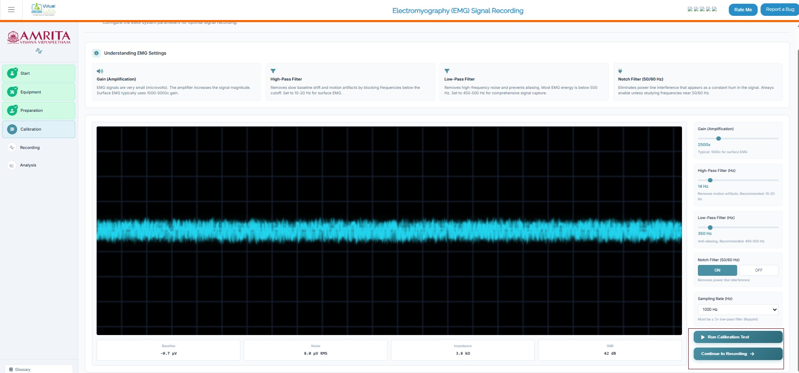
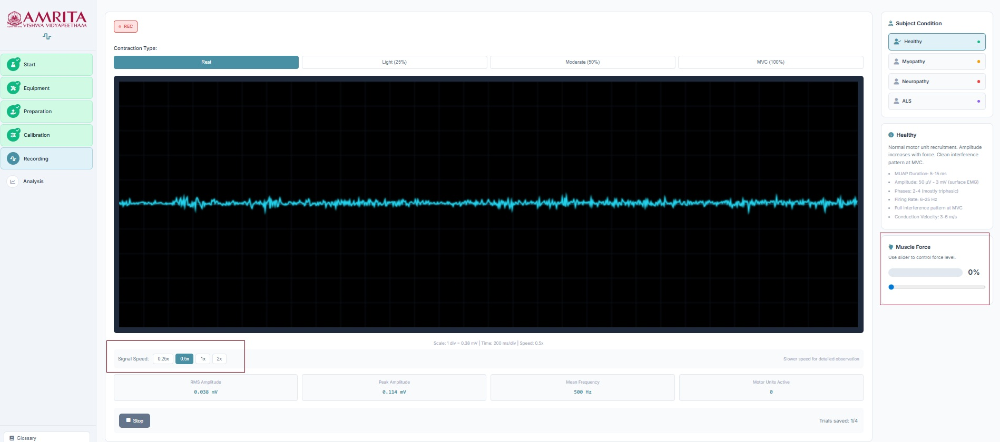
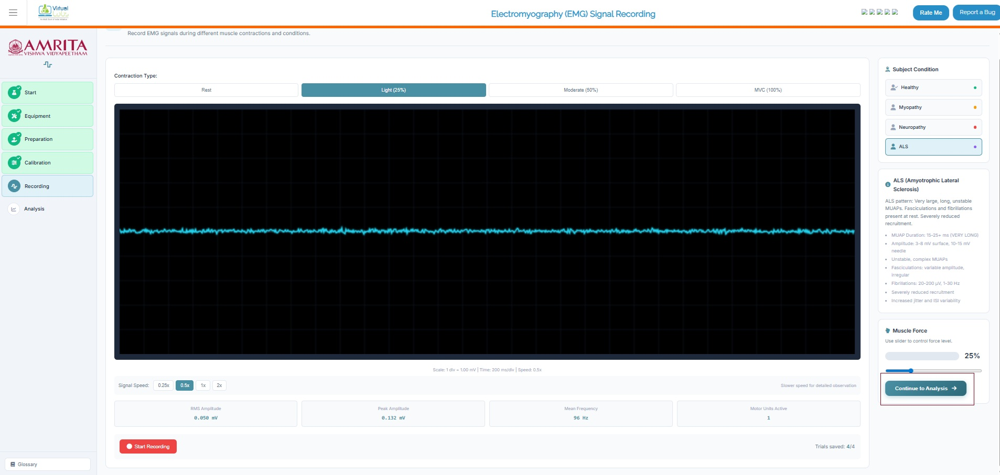
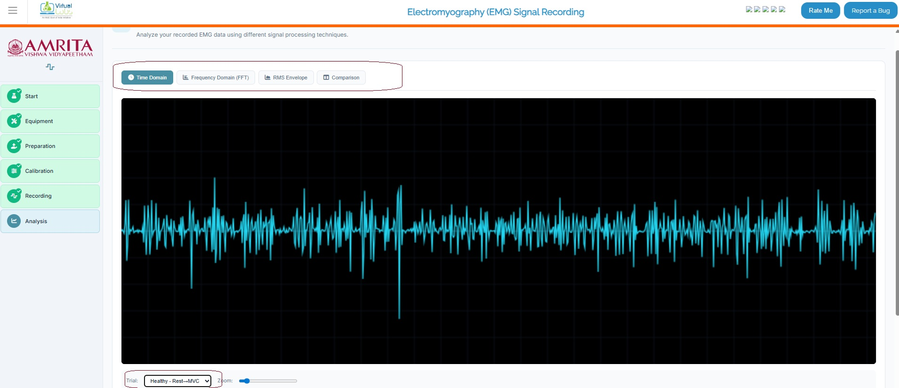
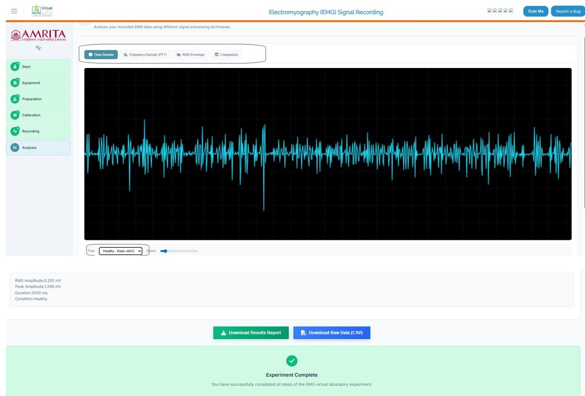
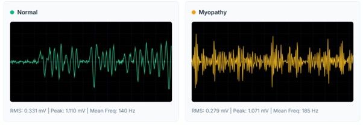
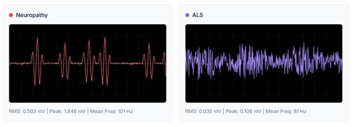

### Steps to work the simulator

1. Click on the simulator tab to start the simulation. A short overview of the experiment is provided. Users can read and understand the experiment before beginning the experiment process. After understanding the concepts clearly, click on the “Begin Experiment” button.

  

&nbsp;

&nbsp;

2. Users can view and perform Equipment Familiarization. Click on each equipment component to get a brief explanation of each piece of equipment.

  

&nbsp;

&nbsp;

3. When completing the six components provided in the simulator window, click on the Continue to preparation button to study EMG recording preparation steps.

  

&nbsp;

&nbsp;

4. Users can select any of the highlighted muscles (Deltoid, Flexor Digitorum, Quadriceps, Gastrocnemius, Tibialis Anterior) in the simulator window to continue the experiment.  Now as an example, the muscle Biceps Brachii (R) is selected. A brief description of the muscle is provided for basic understanding. Click on the “select the muscle button” to proceed. 

  

&nbsp;

&nbsp;

5. The subject preparation and electrode placement method can be visualized at this stage. Here, users must follow a series of steps. First, clean the skin surface with an alcohol swab to remove oil. Drag and drop the clean skin option to the electrode position of the skin surface E1 (muscle belly), E2 (muscle tendon), and ground (bony prominence). Then abrade the skin surface. Click on the Abrade skin surface button. Next is apply gel. Drag and drop the “apply skin gel” to each point to reduce the electrode-skin impedance by filling microscopic gaps between the electrode and skin surface.

&nbsp;

&nbsp;

6. The next step is electrode placement. Drag each electrode to its matching target zone. After finishing these steps, click on the " continue to calibration” button to move on to the next step. 

  

&nbsp;

&nbsp;

7. In the calibration step, a basic understanding of EMG settings (Gain, high pass filter, low pass filter, notch filter) is provided. Click on Run calibration to observe EMG signals from the selected muscle site. Users can see the corresponding baseline recordings, Noise, impedance, and SNR values. Then click on Continue recording to move to the next step of the simulator. 

  

&nbsp;

&nbsp;

8. In the recording phase, use can change the contraction type of the muscle from rest, light, moderate, and maximum voluntary contraction (MVC) to observe the signals. Or the users can slide the muscle force to a particular percentage to observe the difference in the EMG signal. The user can change the subject condition, such as normal to motor disabilities, including myopathy, neuropathy, and ALS. Users can also change the signal speed.  Here, as an example, a healthy subject condition is selected with light muscle force. Click on the start recording button to record EMG.

  

&nbsp;

&nbsp;

9. The EMG signal can be recorded and visualized. The signal properties were provided on the right pane for reference. Click on the stop button to stop recording and then click on save trial to move forward. Users need to repeat this step for the other three diseased conditions: myopathy, neuropathy, and ALS, to proceed with the analysis. 

  

&nbsp;

&nbsp;

10. The number of active motor units and the related signal properties were also recorded in the simulator window. Then click on the continue to analysis button to proceed. 

  

&nbsp;

&nbsp;

11. The result page displays the EMG recorded according to the given input. Users can change the trial and can see the recorded EMG. Time domain, Frequency domain, RMS envelope and comparison of the signal obtained from different subject conditions were displayed. 

  

&nbsp;

&nbsp;

12.	This shows the comparison of the EMG signals from different subject conditions.

  
  

&nbsp;

&nbsp;
13. Users can download the report of the results and raw data in a CSV file.