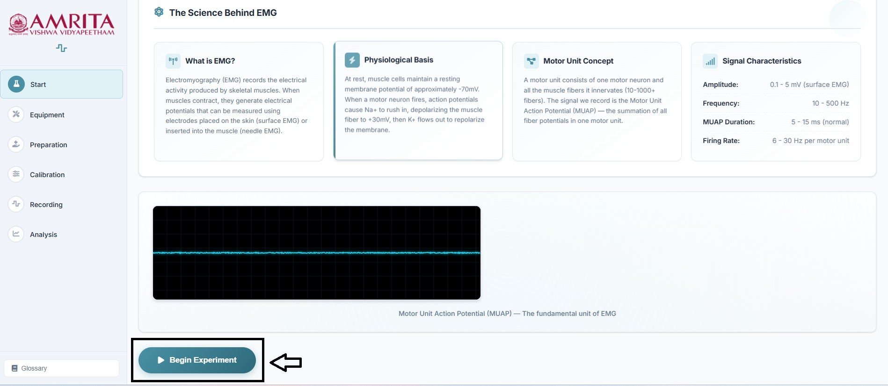
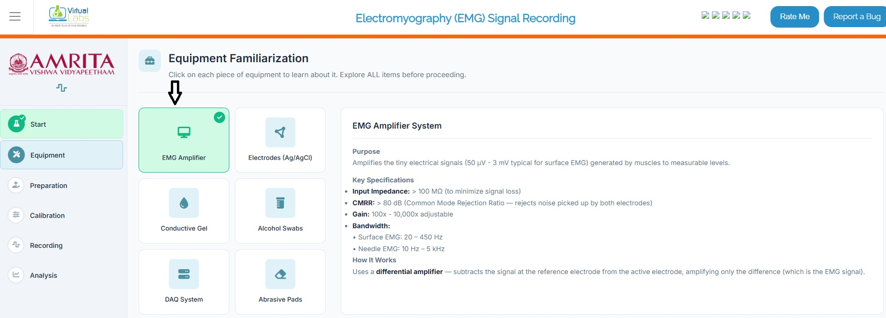
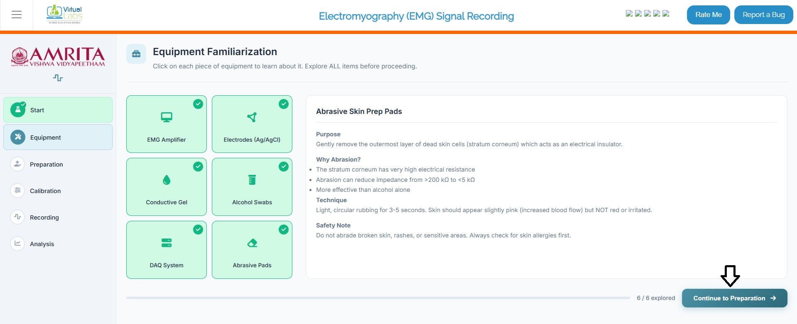
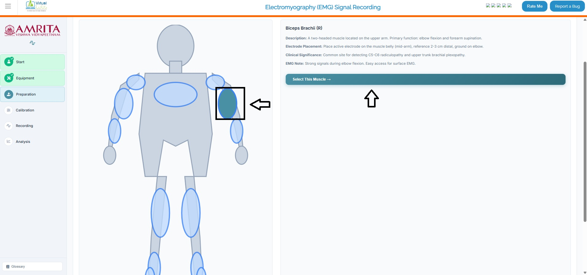
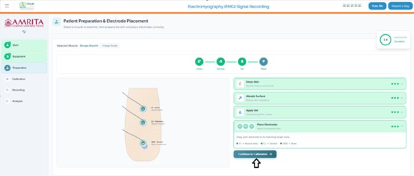

### Steps to work the simulator

1.	Click on the simulator tab to start the simulation. A short overview of the experiment is provided. Users can read and understand the experiment before beginning the experiment process. After understanding the concepts clearly, click on the “Begin Experiment” button.

  

&nbsp;

&nbsp;

2. Users can view and perform Equipment Familiarization. Click on each equipment component to get a brief explanation of each piece of equipment.

  

&nbsp;

&nbsp;

3.	When completing the six components provided in the simulator window, click on the Continue to preparation button to study EMG recording preparation steps.

  

&nbsp;

&nbsp;

4.	Users can select any of the highlighted muscles (Deltoid, Flexor Digitorum, Quadriceps, Gastrocnemius, Tibialis Anterior) in the simulator window to continue the experiment.  Now as an example, the muscle Biceps Brachii (R) is selected. A brief description of the muscle is provided for basic understanding. Click on the “select the muscle button” to proceed. 

  

&nbsp;

&nbsp;

5.	The subject preparation and electrode placement method can be visualized at this stage. Here, users must follow a series of steps. First, clean the skin surface with an alcohol swab to remove oil. Drag and drop the clean skin option to the electrode position of the skin surface E1 (muscle belly), E2 (muscle tendon), and ground (bony prominence). Then abrade the skin surface. Click on the Abrade skin surface button. Next is apply gel. Drag and drop the “apply skin gel” to each point to reduce the electrode-skin impedance by filling microscopic gaps between the electrode and skin surface.

  

&nbsp;

&nbsp;

