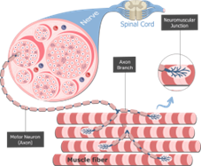
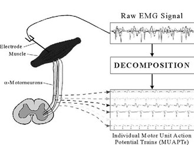
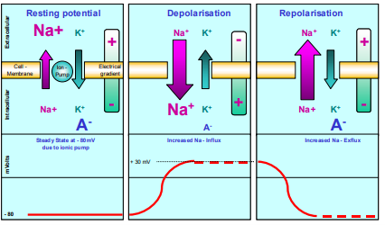
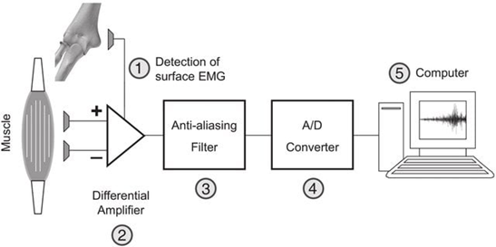

### Theory
The human body is a complex system that includes electrical mechanisms across the brain, heart, muscles, nervous system, and skeletal system. The electrical systems produced by the human body, including the electrical activity occurring in the body and on the skin surface, play a significant role in the medical field. The signals that are generated from the nerves and muscle cells are called bioelectrical signals. Commonly used bioelectrical cells in the human body include electroencephalography (EEG), electromyography (EMG), electrocardiography (ECG), heart rate variability (HRV), and electrodermal activity (EDA). Biomedical engineering deals with the development of medical techniques for supporting medical sciences for various disease diagnosis and prevention. Some of the biosignals reflect spontaneous ongoing signal while some signals arise due to external stimulation. The signal properties vary depending on the processing techniques, such as in some cases, individual waveforms can be directly linked to specific clinical diagnosis while a composite of many waveforms needs to be analyzed before getting a meaningful interpretation in some cases.

&nbsp;
### Electromyography (EMG)
Electromyography is a process of recording electrical signal activity produced by muscles (myoelectric signals) using biomedical engineering devices. These signals are generally small electrical currents produced by muscle fibers before producing the muscle force. These currents occur due to the exchange of ions across the membranes of the muscle fibre, a part of the signalling process responsible for the muscle fibers to contract. The resulting electromyogram can be measured by placing conductive elements, or electrodes, on the skin surface or invasively within the muscle. Surface electromyography (surface EMG) detects the electrical activities of muscles through surface electrodes. Generally, the EMG signal measures electrical currents known as muscle action potentials generated in muscles during contraction, representing neuromuscular activity and being like the neuron's action potential. The contraction or relaxation of muscles was controlled by the nervous system, and the nature of EMG depends on the anatomy and physiology of the muscle fibers. A muscle consists of bundles of specialized cells necessary for contraction and relaxation. A muscle tissue has elasticity and extensibility and can receive stimuli and can respond to it accordingly to perform its functions. Based on the structure, contractile properties, and related control mechanisms, muscle tissues are classified into skeletal muscle, smooth muscle, and cardiac muscle. The EMG applies to the study of skeletal muscles, which are attached to the bone, and their contractions, initiated by the neurons to the muscle fibers, are responsible for movements that are voluntary in nature. 

&nbsp;
#### Motor Unit
The motor unit refers to the fundamental structure that is assessed for electromyogram. It is the smallest functional unit comprising a motor neuron and the muscle fibers innervated by that neuron for describing the neural control of muscular contraction. A motor unit consists of one alpha motor neuron, which is in the spinal cord, an axon from a nerve cell to a skeletal muscle, and all the muscle fibers that are innervated by the motor axon. All the muscle fibers act “as one” within the innervation process. The site where motor axons terminate on individual muscle cells is called the neuromuscular junction (Figure 1).  
&nbsp;

  
   
  <i>Figure 1. Each motor neuron synapses with multiple muscle fibers

Source: Hall, J. E. (2021). Guyton and Hall Textbook of Medical Physiology (14th ed.). Philadelphia: Elsevier.
</i>

&nbsp;

When a motor neuron fires, all fibers within that motor unit depolarize simultaneously, producing an electrical signal referred to as a Motor Unit Action Potential (MUAP).  Typically, Motor Unit Action Potentials (MUAPs) are the electrical signals generated by the collective firing of muscle fibers within a single motor unit, typically measured in milliseconds. In other words, the MUAPs denote the summarization of action potentials generated from all muscle fibers within the single motor system. Electromyography measures these MUAPs for evaluating the functional state of the neuromuscular system. (Figure 2) 
&nbsp;

  
   
  <i>Figure 2. Collective firing of muscle fibers and production of motor unit action potential that is measured as an EMG signal. 

Source: Tagore S, Reche A, Paul P, et al. (December 19, 2023) Electromyography: Processing, Muscles' Electric Signal Analysis, and Use in Myofunctional Orthodontics. Cureus 15(12): e50773. doi:10.7759/cureus.50773
</i>

&nbsp;
#### Physiological basis of muscle membrane excitability

Muscle membrane excitability refers to the physiological properties of the muscle cell membrane, known as the sarcolemma, that generate and propagate action potentials in response to stimuli initiated primarily by acetylcholine at the neuromuscular junction. It involves a series of ion channel–mediated electrical events that convert a neural signal into a muscle action potential (Figure 3). The process can be explained by a model representing a semi-permeable membrane describing the electrical properties of the sarcolemma. Initially, a Resting Membrane Potential (RMP) is established due to the difference in the ionic equilibrium between the intracellular and extracellular spaces of muscle fiber. A resting potential of –80 to –90 mV is formed since Na⁺, K⁺, and Cl⁻ ions are distributed unequally. This creates an inside of the muscle cell that is negatively charged compared to the outside. Na⁺/K⁺ ATPase ion pump maintains this potential pumping 3 Na⁺ out and 2 K⁺ inside. These electrochemical gradients are necessary for membrane excitability. When the alpha motor neuron in the anterior horn of the spinal cord is activated by the central nervous system or reflex, the resulting action potential is conducted to the motor nerve fiber toward the muscle. When this impulse reaches the motor terminal, Acetylcholine (ACh) is released into the synaptic cleft and binds to receptors present at the motor end plate. An endplate potential is thus created at the muscle fiber innervated by this motor unit. The permeability of Na⁺ ions increases into the intracellular muscle fiber, and a local depolarization called the End Plate Potential is created. When end plate potential reaches threshold, Voltage-gated Na⁺ channels open and a rapid influx of Na⁺ occurs.This is the depolarization phase, the membrane potential becomes less negative (from – 80 mV up to + 30 mV) and generates a muscle action potential. 
&nbsp;

  
   
  <i>Figure 3. Steps involved in the muscle membrane excitation process

Source:Konrad, P. (2005). The ABC of EMG. A practical introduction to kinesiological electromyography, 1(2005), 30-5.

</i>

&nbsp;

This electrical spike is monopolar and is what EMG detects as the main spike component. After depolarization, the Na⁺ channels become inactivated and Voltage-gated K⁺ channels open so that K⁺ ions exists in the cell causing the membrane potential to return towards resting level (–80 to –90 mV). Sometimes the membrane become more negative than the resting potential due to influx of K+ ions known as hyperpolarized state. As a motor unit contains many muscle fibers, all fibers in one motor unit depolarize together at the same time and their electrical signals sum together to form a Motor Unit Action Potential, which is recorded in the EMG. After depolarization, the backward exchange of ions (Na⁺ channels close and K⁺ ions move out of the cell) within the active ion pump mechanism is activated and brings the membrane to its resting potential, called Repolarization. This initiates the muscle fiber for the next excitation process. 

### Basic Components of a Surface EMG Measurement System

As discussed in the previous section, in a surface electromyography (sEMG) system, the electrical activity of skeletal muscles was measured using electrodes placed on the skin overlying the muscle. The summed extracellular Motor Unit Action Potentials  during muscle activation are measured. The basic components (Figure 4) of sEMG system includes: 

**Surface Electrodes:** These are non-invasive sensors placed on the skin for the detection, recording and analyzing the electrical activity (MUAPs), produced during muscle contractions. The commonly used surface electrodes are silver/silver chloride (Ag/AgCl) electrodes. 

**EMG amplifier:** The EMG signals are very weak about 50 µV to 5 mV that cannot be processed directly and easily affected by noise and other interferences. The amplifier increases the amplitude of the signal to a measurement level. The input impedance refers to the resistance given by the amplifier and determines the actual transfer of muscle signal from the electrode interface to the amplifier. Differential amplifiers are used that amplifies voltage difference between electrodes. The Common Mode Rejection Ratio (CMRR) represents the role of differential amplifiers in rejecting signals that are common to both input electrodes, while amplifying the true difference signal from the muscle. It reduces external noise and powerline interferences. 

**Filter System:** As discussed, EMG signals are low magnitude signals, often in the microvolt range before amplification, and can cause contamination from various noise sources. Common interferences include power-line interference, baseline wandering, white Gaussian noise, motion artifacts, and high-frequency electronic noise. This will affect the accurate extraction of physiological information from raw EMG data. EMG signal preprocessing is a foundational technique for removing such noises. The bandpass filtering helps to extract physiologically relevant components of muscle activity while removing extraneous noise that distorts the EMG signal. The lower cutoff frequency, usually set at 20 Hz to remove baseline drift due to sweat accumulation, electrode-skin interface movement, and body movements associated with respiration. The upper cutoff is generally fixed at 500 Hz, for reducing the high frequency noise due to electromagnetic sources such as laboratory equipment, electronic devices and cable resonance phenomena. A notch filter is generally used in an EMG system to remove a specific unwanted frequency (50-60Hz), usually power line interference.

**Data Acquisition System / Computer:** The EMG signals are continuous (analog) and the DAQ system converts this analog signal into a digital signal so that it can be recorded, displayed and analyzed on a computer. 

&nbsp;

  
   
  <i>Figure 4. Representation of basic components of an EMG system

Source: Garcia, M. C., & Vieira, T. M. M. (2011). Surface electromyography: Why, when and how to use it. Revista andaluza de medicina del deporte, 4(1), 17-28.

</i>

&nbsp;
### Steps in EMG Recording 

EMG measurements depend directly on proper skin preparation and electrode placement. Skin preparation should be taken care of for stable electrode contact and low skin impedance. Removal of the hair at the proper site is needed for improving adhesion of the electrodes. Special abrasive and conductive cleaning pastes, use of sandpaper with an alcohol pad, pure use of alcohol are advisable for skin cleaning.  The skin appears a light red color that indicates a good skin impedance condition for EMG recording. Next is electrode placement, place two active electrodes on the muscle belly and one reference electrode on the bony area, and an inter-electrode distance of about 2 cm. Connect the electrodes to the EMG system, record the signal, followed by signal processing. 
&nbsp;

### Clinical Applications
Electromyography signals were correlated to evaluate nerve-to-muscle signal transmission, which is crucial for diagnosing neuromuscular disorders, muscle weakness, cramps, and paralysis. Neuromuscular diseases are those affecting the function of muscles, disrupting communication between the brain due to problems associated with nerves and muscles. Common examples of neuromuscular diseases are myopathy, neuropathy and Amyotrophic Lateral Sclerosis (ALS). Myopathies generally refers to heterogeneous group of disorders primarily affecting the skeletal muscle structure, metabolism or channel function. The common symptoms include weakness, stiffness, cramps, and spasms interfering daily life activities. In this condition, muscle fibers within a motor unit are lost or damaged, fewer muscle fibers produce electrical activity, thus the amplitude of MUAP are smaller.  Neuropathy, commonly known as peripheral neuropathy refers to damages to the nerves causing numbness, tingling, burning pain, and muscle weakness in the hands or feet. In this condition, when motor neurons are damaged, surviving neurons reinnervate the denervated muscle, resulting in larger motor units. This produces long-duration motor unit potentials with High-amplitude MUAPs with complex waveforms. Amyotrophic lateral sclerosis (ALS) or Lou Gehrig's disease refers to a neurological disorder that affects motor neurons. The early symptoms included muscle twitches in the arm, leg, shoulder, or tongue, Muscle cramps, and Tight and stiff muscles. In this condition, degeneration of motor neurons causes denervation of muscle fibers, leading to abnormal spontaneous activity and an overall reduction in  EMG amplitude with polyphasic waves associated with fasciculation (spontaneous firing of an entire motor unit) and fibrillation potentials (spontaneous firing of individual muscle fibers).
